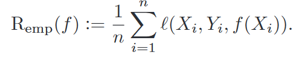
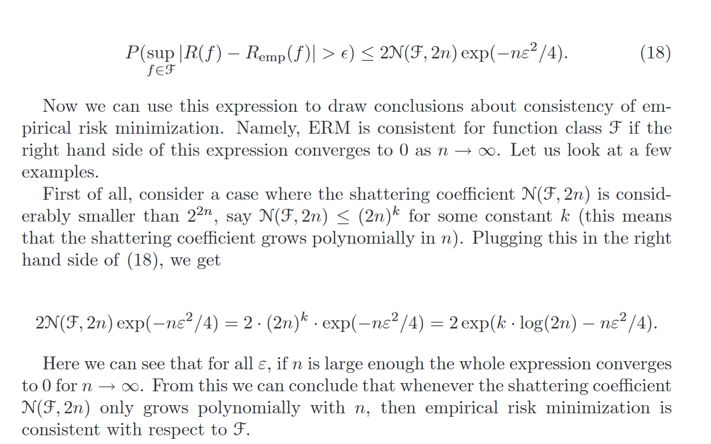

# Machine Learning
## Introdução
Este respositório foi usado para estudo da disciplina **SCC0276 - Machine Learning** ministrada pelo professor [Rodrigo Mello](http://conteudo.icmc.usp.br/pessoas/mello/), que possui um canal no youtube, [ML4U](https://www.youtube.com/channel/UCMSGXqLEE1q5NqG3hjA5vCg), sobre Machine Learning que também foi usado para reforçar o estudo. Os conjuntos de dados utilizados para teste estão disponíveis no [Dataset da UCI](https://archive.ics.uci.edu/ml/datasets.html).

## Aprendizado supervisionado e não-supervisionado
O aprendizado de um programa é definido se a partir de um conjunto de **experiências E** com respeito a alguma **classe de tarefas T** e **medida de desempenho P**, o desempenho de tarefas em T, medido por P, melhora com as experiências E.

O aprendizado de máquina pode ser subdividido em duas categorias principais:
* Supervisionado
	* Conhece-se a classe final para exemplos de treinamento.
	* Pode-se escolher hipóteses com base em acertos e erros dados os exemplos de treinamento.

* Não supervisionado
	* Não se conhece a classe dos exemplos de treinamento
	* Considera-se relações de similaridade/dissimilaridade entre exemplos para separá-los em conjuntos distintos.
	* Os resultados podem ser analisados por um especialista em uma etapa posterior.

A habilidade de genealização de um classificador se refere a seu desempenho ao classificar padrões de teste que não foram utilizado durante o treinamento. Existem dois fatores problemáticos que podem ocorrer em um classificador: _**overfitting**_ e _**underfitting**_.

O _**overfitting**_ é quando o modelo classifica o conjunto de treino muito bem, aprendendo detalhes e ruídos e impactando de forma negativa a performance em novos conjuntos de dados. Já o _**underfitting**_ se refere a quando o modelo não consegue aprender o conjunto de treino nem generalizar para novos dados.

O conjunto de treinamento deve ser bem balanceado, ou seja, conter um volume aproximadamente similar de diferentes instâncias que desejamos classificar para alcançar boa generalização.

## Conceitos básicos da teoria do aprendizado estatistico
O aprendizado é reduzido a econtrar a função **f: X -> Y** que relaciona as entradas (X) com as saídas (Y), o mapeamento f é chamado de *classificador*, e o *algoritmo de classificação* é o procedimento que faz o treinamento do classificador **f**.
O risco é intuitivamente quantos elementos do espaço **X** foram errados pelo classificador **f**, geralmente é calculado pela soma dos erros quadrados, uma função **f** é dita melhor claassificador que **g** se **R(f) < R(g)** e o melhor classificador é aquele com o menor valor **R(f)** possível. O risco calculado a partir do número de erros de um classificador é chamado *risco empirico* ou *erro de treinamento*.

O viés de um classificador **f** é o conjunto de funções que ele consegue representar, dado o conjunto de todas funções existentes.

(Explicar Melhor)

Baseado em [Statistical Learning Theory: Models, Concepts and results - von Luxburg and Scholkopf](https://pdfs.semanticscholar.org/5ce6/0fa851f1f9acb16472d48294661eb9275ef5.pdf)

## Classificação e Regressão

## K-Nearest Neighbors
O K-Nearest Neighbors (KNN) funciona calculando a distância dos K vizinhos mais próximos. Quando um novo ponto de _query_ é enviado para o classificador, são calculadas as distâncias da _query_ para todos os pontos do _dataset_. O código exemplo do [KNN](https://github.com/marcoscrcamargo/MachineLearning/blob/master/KNN.ipynb).

## Distance-Weighted Nearest Neighbors

## K-Means

## Perceptron

## Multilayer Perceptron

## Aprendizado Bayesiano