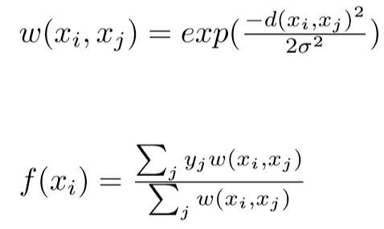

# Machine Learning
## Introdução
Este respositório foi usado para estudo da disciplina **SCC0276 - Machine Learning** ministrada pelo professor [Rodrigo Mello](http://conteudo.icmc.usp.br/pessoas/mello/), que possui um canal no youtube, [ML4U](https://www.youtube.com/channel/UCMSGXqLEE1q5NqG3hjA5vCg), sobre Machine Learning que também foi usado para reforçar o estudo. Os conjuntos de dados utilizados para teste estão disponíveis no [Dataset da UCI](https://archive.ics.uci.edu/ml/datasets.html).

## Aprendizado supervisionado e não-supervisionado
O aprendizado de um programa é definido se a partir de um conjunto de **experiências E** com respeito a alguma **classe de tarefas T** e **medida de desempenho P**, o desempenho de tarefas em T, medido por P, melhora com as experiências E.

O aprendizado de máquina pode ser subdividido em duas categorias principais:
* Supervisionado
	* Conhece-se a classe final para exemplos de treinamento.
	* Pode-se escolher hipóteses com base em acertos e erros dados os exemplos de treinamento.

* Não supervisionado
	* Não se conhece a classe dos exemplos de treinamento
	* Considera-se relações de similaridade/dissimilaridade entre exemplos para separá-los em conjuntos distintos.
	* Os resultados podem ser analisados por um especialista em uma etapa posterior.

A habilidade de genealização de um classificador se refere a seu desempenho ao classificar padrões de teste que não foram utilizado durante o treinamento. Existem dois fatores problemáticos que podem ocorrer em um classificador: _**overfitting**_ e _**underfitting**_.

O _**overfitting**_ é quando o modelo classifica o conjunto de treino muito bem, aprendendo detalhes e ruídos e impactando de forma negativa a performance em novos conjuntos de dados. Já o _**underfitting**_ se refere a quando o modelo não consegue aprender o conjunto de treino nem generalizar para novos dados.

O conjunto de treinamento deve ser bem balanceado, ou seja, conter um volume aproximadamente similar de diferentes instâncias que desejamos classificar para alcançar boa generalização.

## Conceitos básicos da teoria do aprendizado estatistico
O aprendizado é reduzido a econtrar a função **f: X -> Y** que relaciona as entradas (X) com as saídas (Y), o mapeamento f é chamado de *classificador*, e o *algoritmo de classificação* é o procedimento que faz o treinamento do classificador **f**.
O risco é intuitivamente quantos elementos do espaço **X** foram errados pelo classificador **f**, geralmente é calculado pela soma dos erros quadrados, uma função **f** é dita melhor claassificador que **g** se **R(f) < R(g)** e o melhor classificador é aquele com o menor valor **R(f)** possível. O risco calculado a partir do número de erros de um classificador é chamado *risco empirico* ou *erro de treinamento*.

O viés de um classificador **f** é o conjunto de funções que ele consegue representar, dado o conjunto de todas funções existentes.

(Explicar Melhor)

Baseado em [Statistical Learning Theory: Models, Concepts and results - von Luxburg and Scholkopf](https://pdfs.semanticscholar.org/5ce6/0fa851f1f9acb16472d48294661eb9275ef5.pdf)

## Classificação e Regressão
Um problema de classificação é quando você busca encontrar uma classe em um conjunto de valores discretos, por exemplo, identificar o objeto em uma imagem, ou dado as medidas de uma planta encontrar qual a sua especie. Já na regressão, o objetivo é encontrar um valor no espaço continuo obtendo a aproximação de uma função, por exemplo, estimar os preços do mercado imobiliário.

## K-Nearest Neighbors
O K-Nearest Neighbors (KNN) é um algoritmo de classificação que atribuí a classe dos K vizinhos mais próximos ao ponto colocado na _query_.
Quando um novo ponto de _query_ é enviado para o classificador, são calculadas as distâncias (geralmente euclidiana) da _query_ para todos os pontos do _dataset_, e então a classe mais frequente dos K pontos mais próximos é atribuída a _query_. O código exemplo do [KNN](https://github.com/marcoscrcamargo/MachineLearning/blob/master/KNN.ipynb).

## Distance-Weighted Nearest Neighbors
O Distance-Weighted Nearest Neighbors (D-WNN) é uma versão adaptada do KNN utilizada para regressão. O D-WNN calcula o resultado utilizando uma média ponderada com os pesos W(xi, xj), que são calculados por uma função radial gaussiana utilizando a distância euclidiana.

## K-Means
O K-means é um algoritmo de aprendizado não-supervisionado utilizado para o agrupamento de dados.
O algoritmo funciona da seguinte maneira:
* São iniciciados K centroides de maneira aleatória em pontos do conjunto de dados.
* Enquanto E > threshold (limitante de erro)
	1. Para cada centroide K são associados ao centroide K os pontos mais próximosa ele.
	2. Então é atribuido ao centroide K um novo centro calculado a partir das médias dos pontos mais próximos.
	3. Calcula-se o erro E como a variação nas distâncias dos centróides.

* No final, se tem a posição dos K centroides e os pontos associados a cada um.

## Perceptron

## Multilayer Perceptron

## Aprendizado Bayesiano

## Algoritmos Evolutivos e Genéticos
É utilizado o fitness como medida de avaliação para cada candidato da população (por padrão, quanto maior o fitness melhor)

A mutação é feita por uma pequena probabilidade do gene de um individuo da população se alterar.

Crossover

### Steady State
É gerado um filho por meio da mutação de um pai selecionado aleatóriamente, e então é realizado um novo sorteio em toda a população para competir com o filho gerado. O mais forte (com melhor fitness) sobrevive.

### Modelo em batch ou de geração
São gerados K filhos a partir de mutação de K pais selecionados aleatóriamente, e para cada filho é realizado um novo sorteio em toda a população para competir com o filho gerado. O mais forte (com melhor fitness) sobrevive.

### Primeiro algoritmo de programação evolutiva
É gerado um filho pra cada individuo da população por mutação (tamanho m), e então é combinado pais e filhos para gerar uma nova população de tamanho 2m, e então são mantidos apenas os individuos com m melhores fitness.
A convergência desse algoritmo é mais rápida devido ao elitismo (manter os melhores), porem tende a ficar presos em mínimos locais.

### Algoritmo Genético
Cada individuo é representado por um cromossomo composto por genes. A reprodução é feita com dois pais a partir do crossover dos seus genes (combinação dos genes dos pais).
A principio são sorteados dos pais de maneira aleatória e então são gerados dois novos filhos usando crossover e com uma pequena change de mutação. Apenas os filhos são mantidos na próxima geração

São adicionados três princípios para a seleção dos pais:
* Roulette - Probabilidade de sorteio de cada individuo é proporcional ao seu fitness (lembra uma roleta sendo o fitness o tamanho da area).
* Ranking - Probabilidade de sorteio de cada individuo cresce uniformemente de acordo com o raking do fitness (cresce uniformemente de acordo com a ordem crescente de fitness).
* Tournament - É realizada um 'torneio' entre K elementos, e são selecionados os dois com melhor fitness.

Também é possivel adicionar o elistimo ao algoritmo genético, passando os k melhores individuos para próxima geração.

## Avaliação de Experimentos
Objetivo é minimizar o erro para exemplos nunca vistos, garantindo assim a melhor generalização.

 * **Hold-out** faz uma partição dos exemplos em um conjunto de treinamento (geralmente 1/2 ou 2/3 dos dados) e teste (restante). É importante que os dados sejam equilibrados em termos de classes.
 * **Random Subsampling** é o sorteio aleatório dos exemplos no conjunto de treinamento, e o restante para o conjunto de teste. Dtrain inter Dtest = vazio
 * **K-fold Cross Validation** os dados são organizados em K subconjuntos de tamanhos iguais, um dos conjuntos é utilizado para teste e os demais para treinamento, até que os K subconjuntos tenham sido testados. Pode ser necessário **estratificar** os exemplos, isto é, garantir que haja uma proporção igual de classes em cada subconjunto. o valor de **K = 10** é um bom aproximador pro **leave-one-out**.
 * **Leave-one-out** é a utilização do *K-fold Cross Validation* com **k=n**, sendo n o número total de exemplos. Esse método produz estimativas de erros mais precisas, pois a média das estimativas tende a taxa de erro verdadeiro conforme K aumenta. Por ser computacionalmente caro, é comumente utilizado em conjuto de dados pequenos
 * **Bootstrap** é comumente utilizado em conjunto de dados pequenos, criando amostras aleatórias com substituição com tamanho no máximo igual ao de exemplos e os exemplos que não aparecem no conjunto de dados são utilzados para teste. O resultado final é a média de b experimentos.

 Para problemas binários é possivel utilizar a matriz de confusão.
 Possiveis medidas para matriz de confusão:
 	Recal
 	Precisão
 	Sensibilidade
 	Especificidade
 	Acurácia
 	Medida F
 	Medida F1

Gráficos Receiver Of Characteristcs (ROC)
Gráfico de TVP x TFP, onde são postados os classificadores, e é traçado uma reta de (0,0) até (1,1) que representa o classificador aleatório. Os melhores classificadores são os que mais se distanciam dessa reta. O ponto (0, 1) contém o melhor classificador, enquanto que (1, 0) contém o pior classificador.

TVP = VP/(VP+FN) ou revocação

TFP = FP/(FP+VN) representa alarmes falsos

